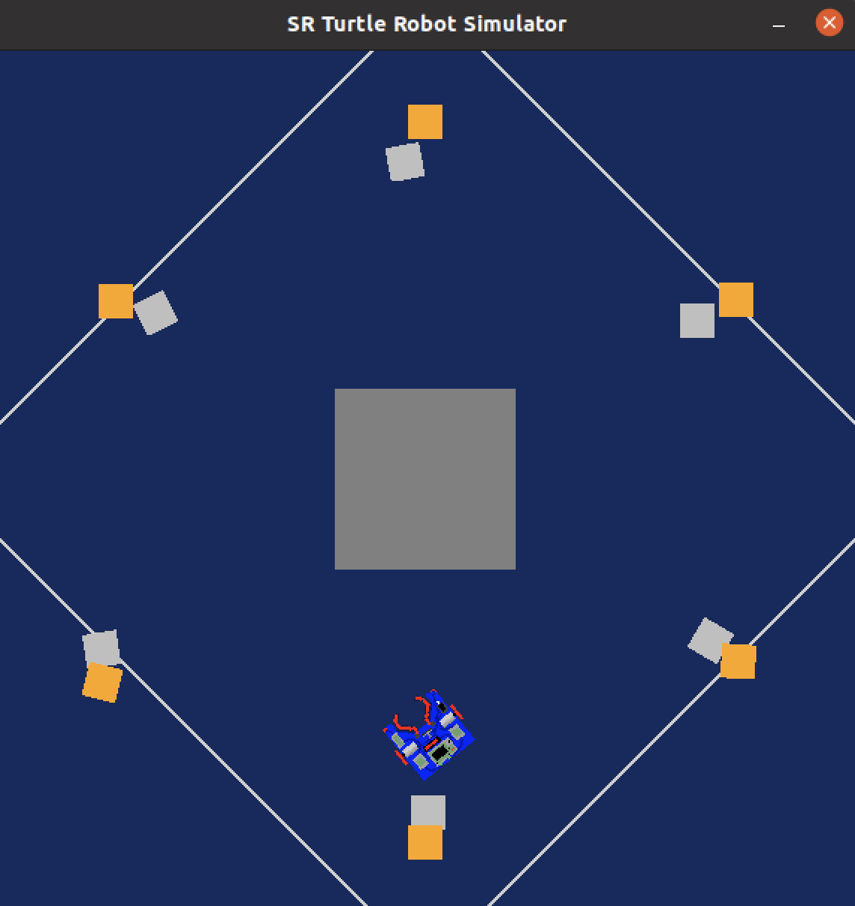

Research Track 1 first assignment
================================
Based on a straightforward, portable robot simulator. For the Research Track I course, several of the activities and arenas have been changed. The silver tokens must be caught by the robot and placed next to the goled tokens.

# **The robot**
  

* # **The silver token**
  

* # **The golden token**
  


* # **The silver token grabbed**
  

* # **The golden token grabbed**
  


# Installing and running
----------------------

The simulator requires a Python 2.7 installation, the [pygame](http://pygame.org/) library, [PyPyBox2D](https://pypi.python.org/pypi/pypybox2d/2.1-r331), and [PyYAML](https://pypi.python.org/pypi/PyYAML/).

Pygame, unfortunately, can be tricky (though [not impossible](http://askubuntu.com/q/312767)) to install in virtual environments. If you are using `pip`, you might try `pip install hg+https://bitbucket.org/pygame/pygame`, or you could use your operating system's package manager. Windows users could use [Portable Python](http://portablepython.com/). PyPyBox2D and PyYAML are more forgiving, and should install just fine using `pip` or `easy_install`.


## Exercise
-----------------------------

To run one or more scripts in the simulator, use `run.py`, passing it the file names. 


you can run the program with:

```bash
$ python run.py assignment.py
```

# Robot API
---------


### Motors ###

The simulated robot has two motors configured for skid steering, connected to a two-output [Motor Board](https://studentrobotics.org/docs/kit/motor_board). The left motor is connected to output `0` and the right motor to output `1`.

The Motor Board API is identical to [that of the SR API](https://studentrobotics.org/docs/programming/sr/motors/), except that motor boards cannot be addressed by serial number. So, to turn on the spot at one quarter of full power, one might write the following:

```python
R.motors[0].m0.power = 25
R.motors[0].m1.power = -25
```

### The Grabber ###

The robot is equipped with a grabber, capable of picking up a token which is in front of the robot and within 0.4 metres of the robot's centre. To pick up a token, call the `R.grab` method:

```python
success = R.grab()
```

The `R.grab` function returns `True` if a token was successfully picked up, or `False` otherwise. If the robot is already holding a token, it will throw an `AlreadyHoldingSomethingException`.

To drop the token, call the `R.release` method.

Cable-tie flails are not implemented.

### Vision ###

To help the robot find tokens and navigate, each token has markers stuck to it, as does each wall. The `R.see` method returns a list of all the markers the robot can see, as `Marker` objects. The robot can only see markers which it is facing towards.

Each `Marker` object has the following attributes:

* `info`: a `MarkerInfo` object describing the marker itself. Has the following attributes:
  * `code`: the numeric code of the marker.
  * `marker_type`: the type of object the marker is attached to (either `MARKER_TOKEN_GOLD`, `MARKER_TOKEN_SILVER` or `MARKER_ARENA`).
  * `offset`: offset of the numeric code of the marker from the lowest numbered marker of its type. For example, token number 3 has the code 43, but offset 3.
  * `size`: the size that the marker would be in the real game, for compatibility with the SR API.
* `centre`: the location of the marker in polar coordinates, as a `PolarCoord` object. Has the following attributes:
  * `length`: the distance from the centre of the robot to the object (in metres).
  * `rot_y`: rotation about the Y axis in degrees.
* `dist`: an alias for `centre.length`
* `res`: the value of the `res` parameter of `R.see`, for compatibility with the SR API.
* `rot_y`: an alias for `centre.rot_y`
* `timestamp`: the time at which the marker was seen (when `R.see` was called).

For example, the following code lists all of the markers the robot can see:

```python
markers = R.see()
print "I can see", len(markers), "markers:"

for m in markers:
    if m.info.marker_type in (MARKER_TOKEN_GOLD, MARKER_TOKEN_SILVER):
        print " - Token {0} is {1} metres away".format( m.info.offset, m.dist )
    elif m.info.marker_type == MARKER_ARENA:
        print " - Arena marker {0} is {1} metres away".format( m.info.offset, m.dist )
```

[sr-api]: https://studentrobotics.org/docs/programming/sr/

Functions
---------

The proffesor  implemented some functions to make the robot behave properly. Some of these are easy to understand while others need an explanation to correctly understand the behavior that he wanted the robot to have
while moving into the environment.

### drive() ###

the `drive()`  function was created to allow the robot to move straight, it can go forward, giving to `speed`parameter a positive value, or it can go backward giving to `speed` parameter a negative value

  - `speed`: the linear velocity that we want the robot to assume.
  - `seconds`: the amount of seconds we want to drive.
* Returns
  - None.
* Code
```python
def drive(speed, seconds):
    R.motors[0].m0.power = speed
    R.motors[0].m1.power = speed
    time.sleep(seconds)
    R.motors[0].m0.power = 0
    R.motors[0].m1.power = 0
```

### turn() ###

The `turn()` functions permits the robot to turn on itself.

* Arguments 
  - `speed`: the angular velocity that we want the robot to assume.
  - `seconds`: the amount of seconds we want the robot to turn.
* Returns
  - None.
* Code
```python
def turn(speed, seconds):
    R.motors[0].m0.power = speed
    R.motors[0].m1.power = -speed
    time.sleep(seconds)
    R.motors[0].m0.power = 0
    R.motors[0].m1.power = 0
```

### Grab() ###

The `Grab()` function contains the routine to grab the token, after this the robot turns, drive for a short distance, leave the token and then it comes back to its original
position.

* Arguments 
  - None.
* Returns
  - None
* Code
```python
def Grab():
 	if R.grab():
                lst_silver_tokens.append(code)
                print("Gotcha!")
                # make the robot turn
                turn(20, 2)
                silver = not silver 
```

### find_silver_token() ###

The `find_silver_token()` function is used to find all the silver tokens around the robot. The robot can see the silver token thanks to the method `R.see()`. Since we want only silver tokens, we want to
have as `marker_type` `MARKER_TOKEN_SILVER`, thanks to this function we can consider only the silver tokens.

                                                  
* Arguments 
  - None.
* Returns
  - `code`: identifier of the gold token (-1 if no gold token is detected)
  - `dist`: distance of the closest silver token (-1 if no silver token is detected)
  - `rot_y`: angle between the robot and the silver token (-1 if no silver token is detected)

* Code
```python
def find_silver_token():
  dist=100
    for token in R.see():
        if token.dist < dist and token.info.marker_type is MARKER_TOKEN_SILVER and token.info.code not in lst_silver_tokens :
            dist = token.dist
            rot_y = token.rot_y
            code = token.info.code
           
    if dist==100:
        return -1, -1, -1
    else:
        return code, dist, rot_y
```

### find_golden_token() ###

The `find_gold_token()` function is used to find all the golden tokens around the robot. The robot can see the gold token thanks to the method `R.see()`. Since we want only gold tokens, we want to
have as `marker_type` `MARKER_TOKEN_GOLD`, thanks to this function we can consider only the gold tokens that are at a at a maximum distance of `100` from the robot and within the following angle, this is better understandable in the image below.

                                                   
* Arguments 
  - None.
* Returns
  - `dist`: distance of the closest silver token (-1 if no gold token is detected)
  - `rot_y`: angle between the robot and the silver token (-1 if no gold token is detected)
  - `code`: angle between the robot and the silver token (-1 if no gold token is detected)
* Code
```python
def find_gold_token():
  dist=100
  for token in R.see():
      if token.dist < dist and token.info.marker_type is MARKER_TOKEN_GOLD and token.info.code not in lst_golden_tokens:
          
          dist = token.dist
          rot_y = token.rot_y
          code = token.info.code
  if dist==100:
      return -1, -1, -1
  else:
      return code, dist, rot_y
```

